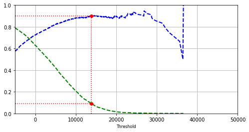
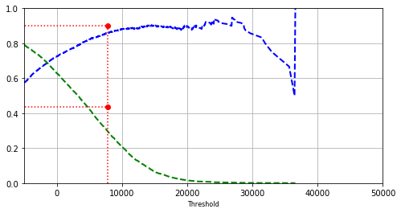
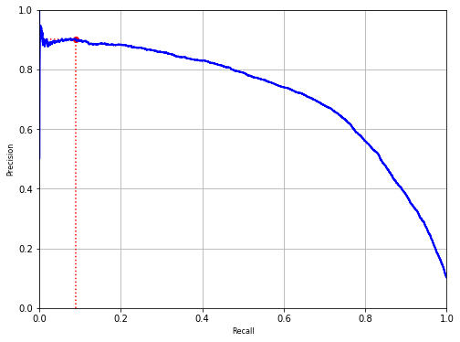
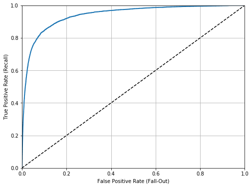
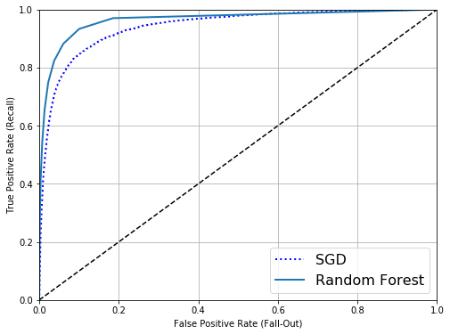

# Fashion-MNIST without Deep Learning
Because I'm a glutten for punishment, I wanted to analyze the Fashion-MNIST dataset just like Aurelien Geron's Hands-On Machine Learning, chapter 3. 

The Fashion-MNIST dataset is a built-in dataset in Pytorch, Keras, Tensorflow, etc., but I want to implement the tools used in the book. Chapter 3 doesn't go over any of these libraries. 

Unfortunately, we need to take an extra step by converting the data files into CSV. Luckily, I did enough Google searches to find this [Kaggle dataset](https://www.kaggle.com/fengerzh/random-forest-classification-for-fashion-mnist) which already converted the Fashion-MNIST. It uses a script from this [website](https://pjreddie.com/projects/mnist-in-csv/)

Let's give it a shot. 


```python
# Common imports
import pandas as pd
import csv
```

Checking the working directory


```python
pwd
```


    '/Users/p911/Documents/12 Fuzzy Minds/Hands on ML 2nd Edition/Chapter 3 Coding'


```python
df = pd.read_csv('fashion-mnist_train.csv', dtype=int)
dft = pd.read_csv('fashion-mnist_test.csv', dtype=int)

```


```python
X_train = df.drop('label', axis=1)
y_train = df['label']
X_test = dft.drop('label', axis=1)
y_test = dft['label']
```


```python
X_train.shape
```


    (60000, 784)


```python
y_train.shape
```


    (60000,)


Let's take a look at the first image just to be sure this is working out. 

Whoops, you're going to get an error because this is a CSV file. 


```python
import matplotlib as mpl
import matplotlib.pyplot as plt

some_digit = X_train[0]
some_digit_image = some_digit.reshape(28, 28)

plt.imshow(some_digit_image, cmap="binary")
plt.axis("off")
plt.show()
```


    ---------------------------------------------------------------------------

    KeyError                                  Traceback (most recent call last)

    /usr/local/Caskroom/miniconda/base/lib/python3.7/site-packages/pandas/core/indexes/base.py in get_loc(self, key, method, tolerance)
       2896             try:
    -> 2897                 return self._engine.get_loc(key)
       2898             except KeyError:


    pandas/_libs/index.pyx in pandas._libs.index.IndexEngine.get_loc()


    pandas/_libs/index.pyx in pandas._libs.index.IndexEngine.get_loc()


    pandas/_libs/hashtable_class_helper.pxi in pandas._libs.hashtable.PyObjectHashTable.get_item()


    pandas/_libs/hashtable_class_helper.pxi in pandas._libs.hashtable.PyObjectHashTable.get_item()


    KeyError: 0

    
    During handling of the above exception, another exception occurred:


    KeyError                                  Traceback (most recent call last)

    <ipython-input-8-fa167b783677> in <module>
          2 import matplotlib.pyplot as plt
          3 
    ----> 4 some_digit = X_train[0]
          5 some_digit_image = some_digit.reshape(28, 28)
          6 


    /usr/local/Caskroom/miniconda/base/lib/python3.7/site-packages/pandas/core/frame.py in __getitem__(self, key)
       2993             if self.columns.nlevels > 1:
       2994                 return self._getitem_multilevel(key)
    -> 2995             indexer = self.columns.get_loc(key)
       2996             if is_integer(indexer):
       2997                 indexer = [indexer]


    /usr/local/Caskroom/miniconda/base/lib/python3.7/site-packages/pandas/core/indexes/base.py in get_loc(self, key, method, tolerance)
       2897                 return self._engine.get_loc(key)
       2898             except KeyError:
    -> 2899                 return self._engine.get_loc(self._maybe_cast_indexer(key))
       2900         indexer = self.get_indexer([key], method=method, tolerance=tolerance)
       2901         if indexer.ndim > 1 or indexer.size > 1:


    pandas/_libs/index.pyx in pandas._libs.index.IndexEngine.get_loc()


    pandas/_libs/index.pyx in pandas._libs.index.IndexEngine.get_loc()


    pandas/_libs/hashtable_class_helper.pxi in pandas._libs.hashtable.PyObjectHashTable.get_item()


    pandas/_libs/hashtable_class_helper.pxi in pandas._libs.hashtable.PyObjectHashTable.get_item()


    KeyError: 0


```python
X_train.describe()
```


<div>
<style scoped>
    .dataframe tbody tr th:only-of-type {
        vertical-align: middle;
    }

    .dataframe tbody tr th {
        vertical-align: top;
    }

    .dataframe thead th {
        text-align: right;
    }
</style>
<table border="1" class="dataframe">
  <thead>
    <tr style="text-align: right;">
      <th></th>
      <th>pixel1</th>
      <th>pixel2</th>
      <th>pixel3</th>
      <th>pixel4</th>
      <th>pixel5</th>
      <th>pixel6</th>
      <th>pixel7</th>
      <th>pixel8</th>
      <th>pixel9</th>
      <th>pixel10</th>
      <th>...</th>
      <th>pixel775</th>
      <th>pixel776</th>
      <th>pixel777</th>
      <th>pixel778</th>
      <th>pixel779</th>
      <th>pixel780</th>
      <th>pixel781</th>
      <th>pixel782</th>
      <th>pixel783</th>
      <th>pixel784</th>
    </tr>
  </thead>
  <tbody>
    <tr>
      <th>count</th>
      <td>60000.000000</td>
      <td>60000.000000</td>
      <td>60000.000000</td>
      <td>60000.000000</td>
      <td>60000.000000</td>
      <td>60000.000000</td>
      <td>60000.000000</td>
      <td>60000.000000</td>
      <td>60000.000000</td>
      <td>60000.000000</td>
      <td>...</td>
      <td>60000.000000</td>
      <td>60000.000000</td>
      <td>60000.000000</td>
      <td>60000.000000</td>
      <td>60000.000000</td>
      <td>60000.000000</td>
      <td>60000.000000</td>
      <td>60000.000000</td>
      <td>60000.000000</td>
      <td>60000.00000</td>
    </tr>
    <tr>
      <th>mean</th>
      <td>0.000900</td>
      <td>0.006150</td>
      <td>0.035333</td>
      <td>0.101933</td>
      <td>0.247967</td>
      <td>0.411467</td>
      <td>0.805767</td>
      <td>2.198283</td>
      <td>5.682000</td>
      <td>14.488767</td>
      <td>...</td>
      <td>34.625400</td>
      <td>23.300683</td>
      <td>16.588267</td>
      <td>17.869433</td>
      <td>22.814817</td>
      <td>17.911483</td>
      <td>8.520633</td>
      <td>2.753300</td>
      <td>0.855517</td>
      <td>0.07025</td>
    </tr>
    <tr>
      <th>std</th>
      <td>0.094689</td>
      <td>0.271011</td>
      <td>1.222324</td>
      <td>2.452871</td>
      <td>4.306912</td>
      <td>5.836188</td>
      <td>8.215169</td>
      <td>14.093378</td>
      <td>23.819481</td>
      <td>38.334549</td>
      <td>...</td>
      <td>57.545242</td>
      <td>48.854427</td>
      <td>41.979611</td>
      <td>43.966032</td>
      <td>51.830477</td>
      <td>45.149388</td>
      <td>29.614859</td>
      <td>17.397652</td>
      <td>9.356960</td>
      <td>2.12587</td>
    </tr>
    <tr>
      <th>min</th>
      <td>0.000000</td>
      <td>0.000000</td>
      <td>0.000000</td>
      <td>0.000000</td>
      <td>0.000000</td>
      <td>0.000000</td>
      <td>0.000000</td>
      <td>0.000000</td>
      <td>0.000000</td>
      <td>0.000000</td>
      <td>...</td>
      <td>0.000000</td>
      <td>0.000000</td>
      <td>0.000000</td>
      <td>0.000000</td>
      <td>0.000000</td>
      <td>0.000000</td>
      <td>0.000000</td>
      <td>0.000000</td>
      <td>0.000000</td>
      <td>0.00000</td>
    </tr>
    <tr>
      <th>25%</th>
      <td>0.000000</td>
      <td>0.000000</td>
      <td>0.000000</td>
      <td>0.000000</td>
      <td>0.000000</td>
      <td>0.000000</td>
      <td>0.000000</td>
      <td>0.000000</td>
      <td>0.000000</td>
      <td>0.000000</td>
      <td>...</td>
      <td>0.000000</td>
      <td>0.000000</td>
      <td>0.000000</td>
      <td>0.000000</td>
      <td>0.000000</td>
      <td>0.000000</td>
      <td>0.000000</td>
      <td>0.000000</td>
      <td>0.000000</td>
      <td>0.00000</td>
    </tr>
    <tr>
      <th>50%</th>
      <td>0.000000</td>
      <td>0.000000</td>
      <td>0.000000</td>
      <td>0.000000</td>
      <td>0.000000</td>
      <td>0.000000</td>
      <td>0.000000</td>
      <td>0.000000</td>
      <td>0.000000</td>
      <td>0.000000</td>
      <td>...</td>
      <td>0.000000</td>
      <td>0.000000</td>
      <td>0.000000</td>
      <td>0.000000</td>
      <td>0.000000</td>
      <td>0.000000</td>
      <td>0.000000</td>
      <td>0.000000</td>
      <td>0.000000</td>
      <td>0.00000</td>
    </tr>
    <tr>
      <th>75%</th>
      <td>0.000000</td>
      <td>0.000000</td>
      <td>0.000000</td>
      <td>0.000000</td>
      <td>0.000000</td>
      <td>0.000000</td>
      <td>0.000000</td>
      <td>0.000000</td>
      <td>0.000000</td>
      <td>0.000000</td>
      <td>...</td>
      <td>58.000000</td>
      <td>9.000000</td>
      <td>0.000000</td>
      <td>0.000000</td>
      <td>0.000000</td>
      <td>0.000000</td>
      <td>0.000000</td>
      <td>0.000000</td>
      <td>0.000000</td>
      <td>0.00000</td>
    </tr>
    <tr>
      <th>max</th>
      <td>16.000000</td>
      <td>36.000000</td>
      <td>226.000000</td>
      <td>164.000000</td>
      <td>227.000000</td>
      <td>230.000000</td>
      <td>224.000000</td>
      <td>255.000000</td>
      <td>254.000000</td>
      <td>255.000000</td>
      <td>...</td>
      <td>255.000000</td>
      <td>255.000000</td>
      <td>255.000000</td>
      <td>255.000000</td>
      <td>255.000000</td>
      <td>255.000000</td>
      <td>255.000000</td>
      <td>255.000000</td>
      <td>255.000000</td>
      <td>170.00000</td>
    </tr>
  </tbody>
</table>
<p>8 rows × 784 columns</p>
</div>


```python
X_train[0:]
```


<div>
<style scoped>
    .dataframe tbody tr th:only-of-type {
        vertical-align: middle;
    }

    .dataframe tbody tr th {
        vertical-align: top;
    }

    .dataframe thead th {
        text-align: right;
    }
</style>
<table border="1" class="dataframe">
  <thead>
    <tr style="text-align: right;">
      <th></th>
      <th>pixel1</th>
      <th>pixel2</th>
      <th>pixel3</th>
      <th>pixel4</th>
      <th>pixel5</th>
      <th>pixel6</th>
      <th>pixel7</th>
      <th>pixel8</th>
      <th>pixel9</th>
      <th>pixel10</th>
      <th>...</th>
      <th>pixel775</th>
      <th>pixel776</th>
      <th>pixel777</th>
      <th>pixel778</th>
      <th>pixel779</th>
      <th>pixel780</th>
      <th>pixel781</th>
      <th>pixel782</th>
      <th>pixel783</th>
      <th>pixel784</th>
    </tr>
  </thead>
  <tbody>
    <tr>
      <th>0</th>
      <td>0</td>
      <td>0</td>
      <td>0</td>
      <td>0</td>
      <td>0</td>
      <td>0</td>
      <td>0</td>
      <td>0</td>
      <td>0</td>
      <td>0</td>
      <td>...</td>
      <td>0</td>
      <td>0</td>
      <td>0</td>
      <td>0</td>
      <td>0</td>
      <td>0</td>
      <td>0</td>
      <td>0</td>
      <td>0</td>
      <td>0</td>
    </tr>
    <tr>
      <th>1</th>
      <td>0</td>
      <td>0</td>
      <td>0</td>
      <td>0</td>
      <td>0</td>
      <td>0</td>
      <td>0</td>
      <td>0</td>
      <td>0</td>
      <td>0</td>
      <td>...</td>
      <td>0</td>
      <td>0</td>
      <td>0</td>
      <td>0</td>
      <td>0</td>
      <td>0</td>
      <td>0</td>
      <td>0</td>
      <td>0</td>
      <td>0</td>
    </tr>
    <tr>
      <th>2</th>
      <td>0</td>
      <td>0</td>
      <td>0</td>
      <td>0</td>
      <td>0</td>
      <td>0</td>
      <td>0</td>
      <td>5</td>
      <td>0</td>
      <td>0</td>
      <td>...</td>
      <td>0</td>
      <td>0</td>
      <td>0</td>
      <td>30</td>
      <td>43</td>
      <td>0</td>
      <td>0</td>
      <td>0</td>
      <td>0</td>
      <td>0</td>
    </tr>
    <tr>
      <th>3</th>
      <td>0</td>
      <td>0</td>
      <td>0</td>
      <td>1</td>
      <td>2</td>
      <td>0</td>
      <td>0</td>
      <td>0</td>
      <td>0</td>
      <td>0</td>
      <td>...</td>
      <td>3</td>
      <td>0</td>
      <td>0</td>
      <td>0</td>
      <td>0</td>
      <td>1</td>
      <td>0</td>
      <td>0</td>
      <td>0</td>
      <td>0</td>
    </tr>
    <tr>
      <th>4</th>
      <td>0</td>
      <td>0</td>
      <td>0</td>
      <td>0</td>
      <td>0</td>
      <td>0</td>
      <td>0</td>
      <td>0</td>
      <td>0</td>
      <td>0</td>
      <td>...</td>
      <td>0</td>
      <td>0</td>
      <td>0</td>
      <td>0</td>
      <td>0</td>
      <td>0</td>
      <td>0</td>
      <td>0</td>
      <td>0</td>
      <td>0</td>
    </tr>
    <tr>
      <th>...</th>
      <td>...</td>
      <td>...</td>
      <td>...</td>
      <td>...</td>
      <td>...</td>
      <td>...</td>
      <td>...</td>
      <td>...</td>
      <td>...</td>
      <td>...</td>
      <td>...</td>
      <td>...</td>
      <td>...</td>
      <td>...</td>
      <td>...</td>
      <td>...</td>
      <td>...</td>
      <td>...</td>
      <td>...</td>
      <td>...</td>
      <td>...</td>
    </tr>
    <tr>
      <th>59995</th>
      <td>0</td>
      <td>0</td>
      <td>0</td>
      <td>0</td>
      <td>0</td>
      <td>0</td>
      <td>0</td>
      <td>0</td>
      <td>0</td>
      <td>0</td>
      <td>...</td>
      <td>0</td>
      <td>0</td>
      <td>0</td>
      <td>0</td>
      <td>0</td>
      <td>0</td>
      <td>0</td>
      <td>0</td>
      <td>0</td>
      <td>0</td>
    </tr>
    <tr>
      <th>59996</th>
      <td>0</td>
      <td>0</td>
      <td>0</td>
      <td>0</td>
      <td>0</td>
      <td>0</td>
      <td>0</td>
      <td>0</td>
      <td>0</td>
      <td>0</td>
      <td>...</td>
      <td>73</td>
      <td>0</td>
      <td>0</td>
      <td>0</td>
      <td>0</td>
      <td>0</td>
      <td>0</td>
      <td>0</td>
      <td>0</td>
      <td>0</td>
    </tr>
    <tr>
      <th>59997</th>
      <td>0</td>
      <td>0</td>
      <td>0</td>
      <td>0</td>
      <td>0</td>
      <td>0</td>
      <td>0</td>
      <td>0</td>
      <td>0</td>
      <td>0</td>
      <td>...</td>
      <td>160</td>
      <td>162</td>
      <td>163</td>
      <td>135</td>
      <td>94</td>
      <td>0</td>
      <td>0</td>
      <td>0</td>
      <td>0</td>
      <td>0</td>
    </tr>
    <tr>
      <th>59998</th>
      <td>0</td>
      <td>0</td>
      <td>0</td>
      <td>0</td>
      <td>0</td>
      <td>0</td>
      <td>0</td>
      <td>0</td>
      <td>0</td>
      <td>0</td>
      <td>...</td>
      <td>0</td>
      <td>0</td>
      <td>0</td>
      <td>0</td>
      <td>0</td>
      <td>0</td>
      <td>0</td>
      <td>0</td>
      <td>0</td>
      <td>0</td>
    </tr>
    <tr>
      <th>59999</th>
      <td>0</td>
      <td>0</td>
      <td>0</td>
      <td>0</td>
      <td>0</td>
      <td>0</td>
      <td>0</td>
      <td>0</td>
      <td>0</td>
      <td>0</td>
      <td>...</td>
      <td>0</td>
      <td>0</td>
      <td>0</td>
      <td>0</td>
      <td>0</td>
      <td>0</td>
      <td>0</td>
      <td>0</td>
      <td>0</td>
      <td>0</td>
    </tr>
  </tbody>
</table>
<p>60000 rows × 784 columns</p>
</div>


```python
y_train[0]
```


    2


```python
y_train[0:]
```


    0        2
    1        9
    2        6
    3        0
    4        3
            ..
    59995    9
    59996    1
    59997    8
    59998    8
    59999    7
    Name: label, Length: 60000, dtype: int64


## Training a classifier

We're choosing a classifier, in this case Stochastic Gradient Descent, and training it based on our data. 


```python
y_train_2 = (y_train == 2)
y_test_2 = (y_test == 2)
```


```python
from sklearn.linear_model import SGDClassifier

sgd_clf = SGDClassifier(random_state=42)
sgd_clf.fit(X_train, y_train_2)
```


    SGDClassifier(alpha=0.0001, average=False, class_weight=None,
                  early_stopping=False, epsilon=0.1, eta0=0.0, fit_intercept=True,
                  l1_ratio=0.15, learning_rate='optimal', loss='hinge',
                  max_iter=1000, n_iter_no_change=5, n_jobs=None, penalty='l2',
                  power_t=0.5, random_state=42, shuffle=True, tol=0.001,
                  validation_fraction=0.1, verbose=0, warm_start=False)


Okay, great, now let's measure the accuracy of the classifier using cross validation.


```python
from sklearn.model_selection import cross_val_score
```


```python
cross_val_score(sgd_clf, X_train, y_train_2, cv=3, scoring="accuracy")
```


    array([0.94075, 0.93685, 0.93935])


## Confusion Matrix

Based on the book, "a much better way to evaluate the performance of a classifer is to look at the confusion matrix... To compute the comufsion matrix, you first need to have a set of predictions so that they can be compared to the actual targets." And we make these predictions still using the test set and using the cross_val_predict() function. 


```python
from sklearn.model_selection import cross_val_predict

y_train_pred = cross_val_predict(sgd_clf, X_train, y_train_2, cv=3)
```

Now let's take a look at that confusion matrix using the confusion_matrix() function. 


```python
from sklearn.metrics import confusion_matrix

confusion_matrix(y_train_2, y_train_pred)
```


    array([[52570,  1430],
           [ 2231,  3769]])


"A perfect classifier would have only true positives and true negatives, so its confusion matrix woudl have nonzero values only on its main diagonal (top left to bottom right)."


```python
y_train_perfect_predictions = y_train_2
```


```python
confusion_matrix(y_train_2, y_train_perfect_predictions)
```


    array([[54000,     0],
           [    0,  6000]])


## Precision & Recall & F1 Score


```python
# Precision & Recall
from sklearn.metrics import precision_score, recall_score
```


```python
precision_score(y_train_2, y_train_pred)
```


    0.7249471052125409


```python
recall_score(y_train_2, y_train_pred)
```


    0.6281666666666667


```python
from sklearn.metrics import f1_score

f1_score(y_train_2, y_train_pred)
```


    0.6730958121260827


## Deciding which threshold to use


```python
y_scores = cross_val_predict(sgd_clf, X_train, y_train_2, cv=3, method="decision_function")
```


```python
from sklearn.metrics import precision_recall_curve

precisions, recalls, thresholds = precision_recall_curve(y_train_2, y_scores)
```


```python
def plot_precision_recall_vs_threshold(precisions, recalls, thresholds):
    plt.plot(thresholds, precisions[:-1], "b--", label="Precision", linewidth=2)
    plt.plot(thresholds, recalls[:-1], "g--", label="Recall", linewidth=2)
    plt.xlabel("Threshold", fontsize=8)
    plt.grid(True)
    plt.axis([-5000, 50000, 0, 1])
        
plt.figure(figsize=(8, 4))                     
plot_precision_recall_vs_threshold(precisions, recalls, thresholds)
plt.plot([13878, 13878], [0., 0.9], "r:")         
plt.plot([-50000, 13878], [0.9, 0.9], "r:")     
plt.plot([-50000, 13878], [0.090, 0.090], "r:")
plt.plot([13878], [0.9], "ro")                  
plt.plot([13878], [0.090], "ro")               
plt.show()
    
```





Now let's just copy and paste his graph (just to see how it compares).


```python
plt.figure(figsize=(8, 4))                      # Not shown
plot_precision_recall_vs_threshold(precisions, recalls, thresholds)
plt.plot([7813, 7813], [0., 0.9], "r:")         # Not shown
plt.plot([-50000, 7813], [0.9, 0.9], "r:")      # Not shown
plt.plot([-50000, 7813], [0.4368, 0.4368], "r:")# Not shown
plt.plot([7813], [0.9], "ro")                   # Not shown
plt.plot([7813], [0.4368], "ro")                # Not shown
plt.show()
```





Notice how the red lines are off? That's because I used the same numbers from the book, which is a different dataset. What I don't get is how he got those numbers. The same for the precision vs recall graph below.


```python
(y_train_pred == (y_scores > 0)).all()
```


    True


Now we're just plotting precision and recall without the threshold.


```python
def plot_precision_vs_recall(precisions, recalls):
    plt.plot(recalls, precisions, "b-", linewidth=2)
    plt.xlabel("Recall", fontsize=8)
    plt.ylabel("Precision", fontsize=8)
    plt.axis([0, 1, 0, 1])
    plt.grid(True)
    
plt.figure(figsize=(8,6))
plt.plot([0.09033,0.09033], [0., 0.9], "r:")
plt.plot([0.0, 0.09033], [0.9, 0.9], "r:")
plt.plot([0.09033], [0.9], "ro")
plot_precision_vs_recall(precisions, recalls)
plt.show()
```





I think the next following functions will help us identify where those red lines are coming from. 


```python
import numpy as np
threshold_90_precision = thresholds[np.argmax(precisions >= 0.90)]
threshold_90_precision
```


    13878.206023017816


```python
y_train_pred_90 = (y_scores >= threshold_90_precision)
```


```python
from sklearn.metrics import precision_score
precision_score(y_train_2, y_train_pred_90)
```


    0.9003322259136213


```python
from sklearn.metrics import recall_score
recall_score(y_train_2, y_train_pred_90)
```


    0.09033333333333333


## The ROC Curve


```python
from sklearn.metrics import roc_curve

fpr, tpr, thresholds = roc_curve(y_train_2, y_scores)
```


```python
def plot_roc_curve(fpr, tpr, label=None):
    plt.plot(fpr,tpr, linewidth=2, label=label)
    plt.plot([0,1], [0,1], 'k--') # Shows the 50% diagonal line
    plt.axis([0, 1, 0, 1])
    plt.xlabel("False Positive Rate (Fall-Out)")
    plt.ylabel("True Positive Rate (Recall)")
    plt.grid(True)
    
plt.figure(figsize=(8, 6))
plot_roc_curve(fpr, tpr)
plt.show()
```





```python
from sklearn.metrics import roc_auc_score

roc_auc_score(y_train_2, y_scores)
```


    0.9403942376543211


## Let's train a Random Forest Classifier

We're going to use the RandomForetsClassifier() function and compare it's ROC curve and ROC AUC score to those fo the SGDClassifier(). 

Remember, with Random Forest, they don't use a decision_function() method, they have a predict_proba() method. 


```python
from sklearn.ensemble import RandomForestClassifier

forest_clf = RandomForestClassifier(random_state=42)
y_probas_forest = cross_val_predict(forest_clf, X_train, y_train_2, 
                                    cv=3, method="predict_proba")

```

    /usr/local/Caskroom/miniconda/base/lib/python3.7/site-packages/sklearn/ensemble/forest.py:245: FutureWarning: The default value of n_estimators will change from 10 in version 0.20 to 100 in 0.22.
      "10 in version 0.20 to 100 in 0.22.", FutureWarning)
    /usr/local/Caskroom/miniconda/base/lib/python3.7/site-packages/sklearn/ensemble/forest.py:245: FutureWarning: The default value of n_estimators will change from 10 in version 0.20 to 100 in 0.22.
      "10 in version 0.20 to 100 in 0.22.", FutureWarning)
    /usr/local/Caskroom/miniconda/base/lib/python3.7/site-packages/sklearn/ensemble/forest.py:245: FutureWarning: The default value of n_estimators will change from 10 in version 0.20 to 100 in 0.22.
      "10 in version 0.20 to 100 in 0.22.", FutureWarning)


Weird, got some future warning. Let's look at this later. 


```python
# Get all the random forest scores
y_scores_forest = y_probas_forest[:, 1]

# Adding the random forest variables
fpr_forest, tpr_forest, thresholds_forest = roc_curve(y_train_2, y_scores_forest)
```


```python
# Now let's plot
plt.figure(figsize=(8,6))
plt.plot(fpr, tpr, "b:", linewidth=2, label="SGD")
plot_roc_curve(fpr_forest, tpr_forest, "Random Forest")
plt.grid(True)
plt.legend(loc="lower right", fontsize=16)
plt.show()
```





```python
roc_auc_score(y_train_2, y_scores_forest)
```


    0.9637865524691358


```python
y_train_pred_forest = cross_val_predict(forest_clf, X_train, y_train_2, cv=3)
precision_score(y_train_2, y_train_pred_forest)
```

    /usr/local/Caskroom/miniconda/base/lib/python3.7/site-packages/sklearn/ensemble/forest.py:245: FutureWarning: The default value of n_estimators will change from 10 in version 0.20 to 100 in 0.22.
      "10 in version 0.20 to 100 in 0.22.", FutureWarning)
    /usr/local/Caskroom/miniconda/base/lib/python3.7/site-packages/sklearn/ensemble/forest.py:245: FutureWarning: The default value of n_estimators will change from 10 in version 0.20 to 100 in 0.22.
      "10 in version 0.20 to 100 in 0.22.", FutureWarning)
    /usr/local/Caskroom/miniconda/base/lib/python3.7/site-packages/sklearn/ensemble/forest.py:245: FutureWarning: The default value of n_estimators will change from 10 in version 0.20 to 100 in 0.22.
      "10 in version 0.20 to 100 in 0.22.", FutureWarning)


    0.8459214501510574


```python
recall_score(y_train_2, y_train_pred_forest)
```


    0.6533333333333333


## Multiclass classification


```python

```
